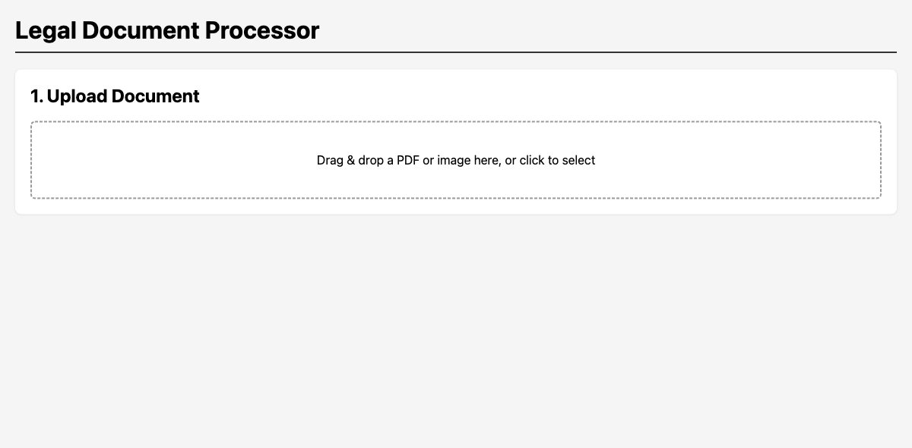
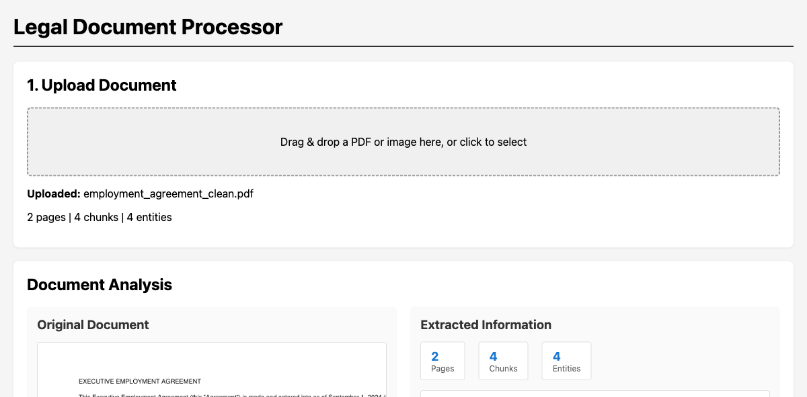
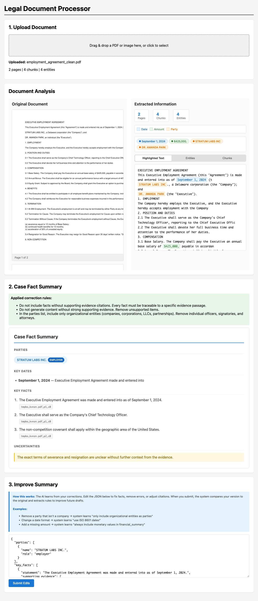
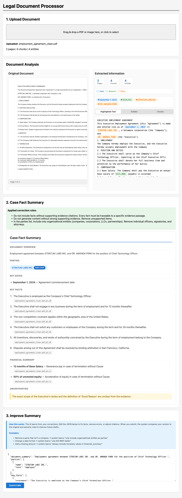

# Legal Document Processor

A pipeline for ingesting messy legal documents, extracting structured information, retrieving grounded evidence, and generating draft case fact summaries that improve from operator feedback.

Built for the Pearson Specter Litt AI Engineer take-home assessment.

> **Architecture Cover Photo:** Open [`docs/architecture-cover.html`](docs/architecture-cover.html) in any browser for a visual overview of the 6-stage pipeline. No build step required.
>
> **Edit Session Demo:** See [`docs/EDIT_SESSION.md`](docs/EDIT_SESSION.md) for a concrete walkthrough of the feedback loop — from initial draft to operator edits to learned rules.

## What It Does

1. **Process** — Extracts text from PDFs and images using hybrid OCR (native text extraction + Tesseract fallback for scanned pages). Sentence-aware chunking ensures no sentence is split across chunks. Extracts entities (dates, amounts, parties, case numbers, case citations, statute citations, court names, judge names) and scores each chunk for OCR confidence.

2. **Retrieve** — Uses hybrid search (dense embeddings via ChromaDB + sparse BM25 + Reciprocal Rank Fusion) with legal query expansion to find the most relevant evidence passages. Every retrieved passage carries a `chunk_id` so its source can be traced.

3. **Generate** — Two-stage generation: first analyzes evidence, then produces a structured `CaseFactSummary` JSON with parties, dates, claims, key facts, document summary, financial summary, and uncertainties. Post-generation semantic grounding verification catches hallucinations that citation validation misses.

4. **Learn** — Captures operator edits via a diff engine, extracts reusable correction rules with 12 heuristic generalizers + LLM fallback, scores rule effectiveness, and injects the best rules into future generation prompts.

## Prerequisites

- Python 3.11+
- [Tesseract OCR](https://github.com/tesseract-ocr/tesseract) installed on your system
  - macOS: `brew install tesseract`
  - Ubuntu: `sudo apt-get install tesseract-ocr`
- A [Groq](https://groq.com/) API key (free tier available)

## Setup

1. **Clone and enter the repository:**
   ```bash
   cd legal-doc-processor
   ```

2. **Create and activate a virtual environment:**
   ```bash
   python -m venv .venv
   source .venv/bin/activate
   ```

3. **Install dependencies:**
   ```bash
   pip install -r requirements.txt
   ```

4. **Set your Groq API key:**
   ```bash
   echo 'GROQ_API_KEY="your_key_here"' > .env
   ```

## Running the Application

### Start the server

```bash
python main.py
```

The FastAPI server starts on `http://localhost:8000`.

### Use the web UI

Open `http://localhost:8000` in a browser. The UI supports:

- Drag-and-drop or click-to-select file upload (PDF, PNG, JPG)
- Side-by-side PDF viewer with rendered page images
- Color-coded entity highlighting in extracted text
- Auto-generated Case Fact Summary with clickable citations
- Grounding score banner showing semantic support strength
- Inline JSON editor for reviewing and editing drafts
- Submitting edits to train the system's correction rules
- Retrieval method badges (dense, sparse, hybrid) and RRF fusion scores

### API Endpoints

| Endpoint | Method | Description |
|---|---|---|
| `/` | GET | Serve the web UI |
| `/upload` | POST | Upload a document (`file: UploadFile`) |
| `/generate` | POST | Generate a draft (`query: str = "Generate a case fact summary"`) |
| `/feedback` | POST | Submit edited draft (`edited_draft: str`) |
| `/rendered/{doc_id}/{page_file}` | GET | Serve rendered page PNG |

Example with `curl`:

```bash
# Upload a document
curl -X POST -F "file=@evaluation/synthetic_docs/contract_clean.pdf" \
  http://localhost:8000/upload

# Generate a draft
curl -X POST -F "query=Generate a case fact summary" \
  http://localhost:8000/generate

# Submit feedback (edit the JSON first)
curl -X POST -F 'edited_draft={"parties": [...]}' \
  http://localhost:8000/feedback
```

## Running Tests

All tests use synthetic data and mocked external calls (no real LLM calls in unit tests).

```bash
# Run the full test suite
pytest tests/ -v

# Run a specific module
pytest tests/test_processor.py -v
pytest tests/test_retrieval.py -v
pytest tests/test_generator.py -v
pytest tests/test_feedback.py -v
pytest tests/test_feedback_improvement.py -v
```

Expected output: 40 tests pass.

### Generate synthetic test documents

```bash
python evaluation/generate_samples.py
```

Creates clean-text and scanned/image PDFs in `evaluation/synthetic_docs/` for manual end-to-end testing.

## Project Structure

```
.
├── main.py                       # FastAPI app with /upload, /generate, /feedback
├── requirements.txt              # Python dependencies
├── core/
│   ├── models.py                 # Pydantic data models
│   ├── processor.py              # DocumentProcessor (OCR, sentence-aware chunking, entity extraction, deskewing)
│   ├── retrieval.py              # EvidenceRetriever (ChromaDB + BM25 + RRF + query expansion)
│   ├── generator.py              # DraftGenerator (two-stage Groq LLM client)
│   ├── feedback.py               # FeedbackEngine (SQLite + rule extraction + effectiveness scoring)
│   └── grounding.py              # GroundingVerifier (post-generation semantic verification)
├── tests/
│   ├── test_processor.py         # 22 tests for chunking, entities, OCR
│   ├── test_retrieval.py         # 3 tests for hybrid search
│   ├── test_generator.py         # 3 tests for prompt assembly and JSON parsing
│   ├── test_feedback.py          # 7 tests for diff capture and rule ranking
│   └── test_feedback_improvement.py  # 5 end-to-end tests for feedback loop
├── evaluation/
│   ├── generate_samples.py       # Creates synthetic PDFs
│   └── synthetic_docs/           # Generated test files
├── static/
│   ├── index.html                # Web UI with split-screen PDF viewer
│   └── app.js                    # Frontend logic with entity highlighting
├── ARCHITECTURE.md               # Full system design with tradeoffs
├── ASSESSMENT.md                 # Original take-home requirements and rubric
└── README.md                     # This file
```

## Screenshot Gallery

| Initial Upload | After Processing | Full Pipeline | Final Draft |
|---|---|---|---|
|  |  |  |  |

## Architecture Overview

The system follows a 5-stage pipeline:

```
Upload (PDF/Image)
    │
    ▼
┌─────────────────┐
│ 1. PROCESS      │──▶ OCR + regex structuring ──▶ raw_text + chunks + entities
│   (processor)   │     Sentence-aware chunking, deskewing, 8 entity types
└─────────────────┘
    │
    ▼
┌─────────────────┐
│ 2. INDEX        │──▶ Embed chunks ──▶ ChromaDB + BM25
│   (retriever)   │     Metadata: source_doc, page_num, confidence_score
└─────────────────┘
    │
    ▼ (Auto-triggered after upload)
┌─────────────────┐
│ 3. RETRIEVE     │──▶ Hybrid dense + sparse search ──▶ RRF fusion
│   (retriever)   │     Legal query expansion, per-chunk retrieval method tracking
└─────────────────┘
    │
    ▼
┌─────────────────┐
│ 4. GENERATE     │──▶ Two-stage: analyze evidence, then generate structured output
│   (generator)   │     Correction rules injection, JSON schema enforcement
└─────────────────┘
    │
    ▼
┌─────────────────┐
│ 5. VERIFY       │──▶ Semantic grounding check ──▶ Ungrounded facts → uncertainties
│   (grounding)   │
└─────────────────┘
    │
    ▼
┌─────────────────┐
│ 6. LEARN        │──▶ Diff original vs edited ──▶ Extract rules, score effectiveness
│   (feedback)    │     SQLite storage; top rules injected into future prompts
└─────────────────┘
```

See `ARCHITECTURE.md` for detailed tradeoffs, assumptions, and rubric alignment.

## Key Design Decisions

- **Hybrid OCR** — Native `pymupdf` text extraction is fast and accurate for clean PDFs. `pytesseract` + image preprocessing (deskew, contrast boost, denoise) is used as a fallback for scanned pages. Per-chunk confidence scoring lets the generator know which text is trustworthy.

- **Sentence-Aware Chunking** — Text is split into sentences first, then grouped into ~300-word chunks. Sentences are never split across chunks, ensuring each retrieved passage contains complete thoughts.

- **Hybrid Retrieval** — Dense embeddings (ChromaDB + `all-MiniLM-L6-v2`) catch semantic similarity. BM25 catches exact matches on case numbers and citations. RRF merges the two without requiring score calibration. Legal query expansion adds synonyms for 15 common legal terms (breach → violation/failure to perform, etc.).

- **Two-Stage Generation** — Stage 1 analyzes evidence and produces a factual outline. Stage 2 uses that outline as context to generate the structured `CaseFactSummary`. This produces more coherent, better-grounded outputs than single-shot generation.

- **Post-Generation Grounding Verification** — After the LLM produces output, a semantic similarity check verifies that each fact is supported by its cited evidence. Facts below a similarity threshold are moved to `uncertainties` with a `[Grounding check]` prefix.

- **Feedback Loop with Effectiveness Scoring** — Rules are not just extracted but also scored. When an operator edits a draft, the system checks which previously-applied rules would have prevented the edit. Rules with low empirical success rates are filtered out before injection.

## Tech Stack

- **Backend:** FastAPI, Python 3.11+
- **OCR:** `pymupdf` (native text) + `pytesseract` (scan fallback with deskewing)
- **Embeddings:** `sentence-transformers` (`all-MiniLM-L6-v2`, 384-dim, CPU)
- **Vector Store:** ChromaDB (persistent, `./data/chroma_db`)
- **Sparse Search:** `rank-bm25`
- **LLM:** Groq API (`llama-3.3-70b-versatile`)
- **Feedback Store:** SQLite (`./data/feedback.db`)
- **UI:** Vanilla HTML/JS served by FastAPI static files
